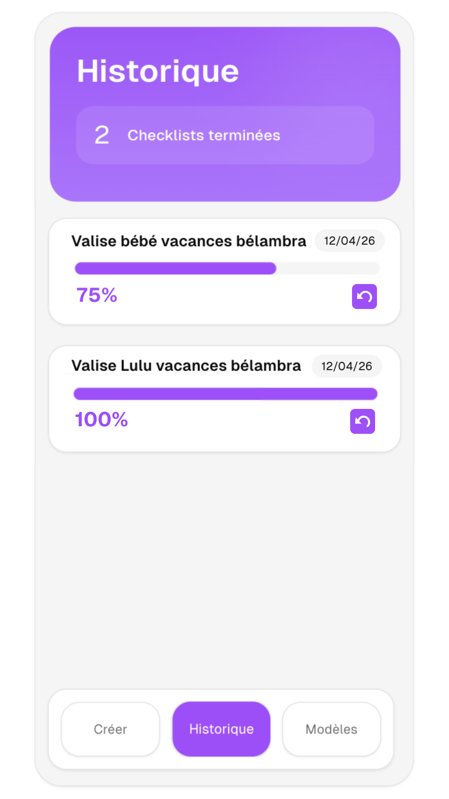

# Instructions de la feature écran d'historique

# Fonctionnalité 1 : affichage de l'écran d'historique
### Action
- L'utilisateur est sur l'écran d'accueil, puis il clique sur le bouton Historique
### Comportement
- L'écran d'historique s'affiche (maquette )
- L'écran conserve le menu en bas de page de l'écran d'accueil.
- Les checklist affichée sont celles qui ont un statut égal à FINISHED
- Les checklist sont affichées de la même façon que dans l'écran d'accueil
- Chaque checklist a un bouton restaurer pour modifier le statut à IN_PROGRESS en cas d'erreur